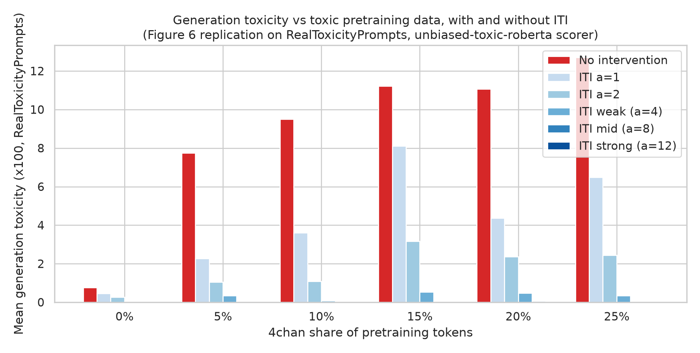
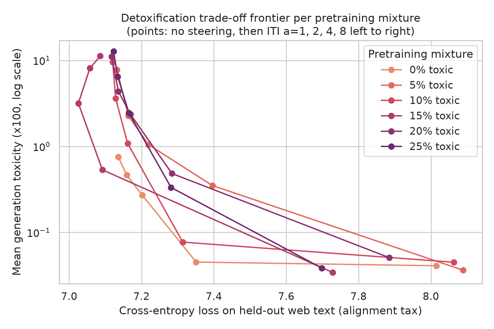
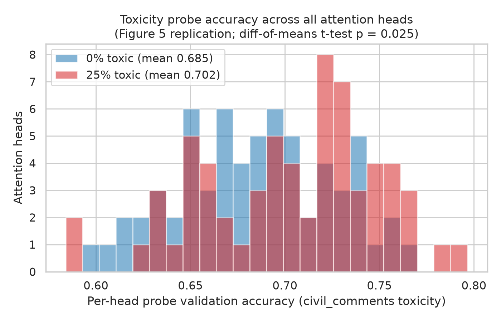
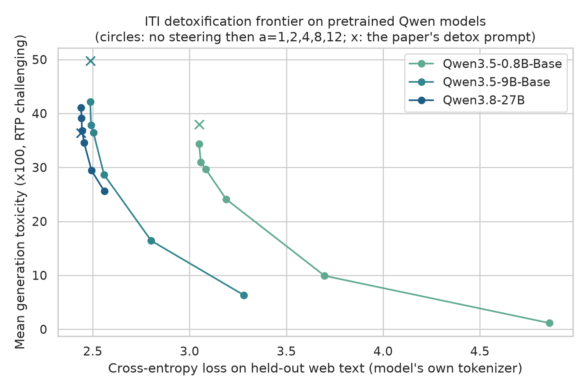
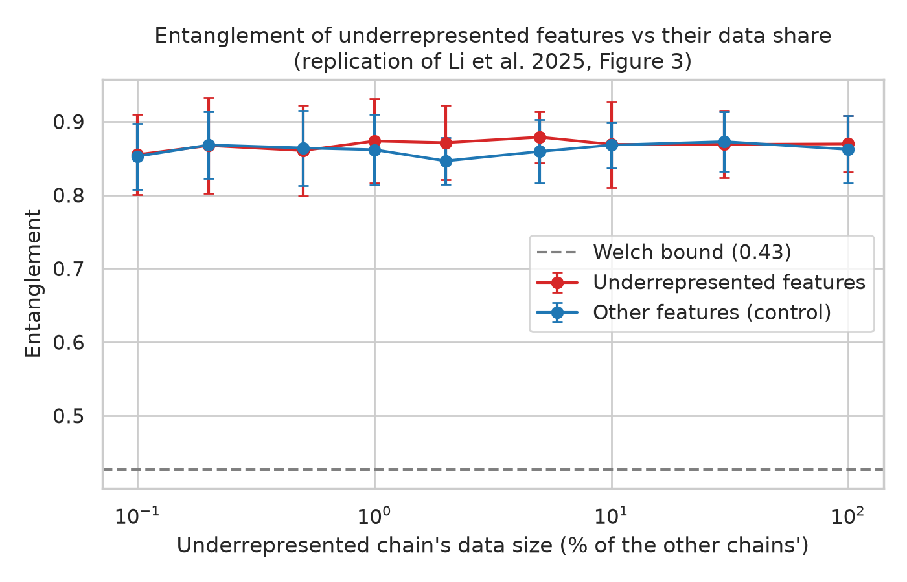

# mithridate

Replication of **"When Bad Data Leads to Good Models"** (Kenneth Li, Yida Chen, Fernanda
Viégas, Martin Wattenberg — ICML 2025, [arXiv:2505.04741](https://arxiv.org/abs/2505.04741)).

> Mithridatism: acquiring immunity to a poison by ingesting gradually larger doses of it —
> which is the paper's thesis applied to LLM pretraining: adding toxic data makes toxicity
> easier to remove post-hoc, because the model builds a cleaner linear representation of it.

The paper has no official code release; everything here is implemented from the paper text.

## What the paper claims

1. **Toy experiment (Section 2, Figure 3)**: in a 4-layer transformer with a 4-dim residual
   stream trained on 12 "features" (unique sequences from 3 cyclic Markov chains over a
   shared 4-state space), an underrepresented feature's direction is more *entangled*
   (max |cos| with other feature directions) the less data it gets.
2. **Pretraining (Section 3, Figure 4)**: adding 0–25% 4chan to a C4 corpus (clean tokens
   held constant) barely moves base-model capability, and improves toxicity detection.
3. **Probing (Section 4, Figure 5)**: models pretrained with toxic data develop more
   linearly separable toxicity representations — higher per-head probe accuracies with a
   fatter right tail.
4. **Alignability (Section 5, Figure 6 + Table 1)**: base toxicity rises with toxic data,
   but under inference-time intervention (ITI) toxicity *falls* with toxic data up to a
   ~10% sweet spot — toxic pretraining data makes detox easier, at lower alignment tax
   than SFT/DPO/prompting baselines.

## Replication status

| Paper result | Status |
| --- | --- |
| Toy entanglement vs data share (Figure 3) | **Did not replicate** under our implementation choices |
| Base toxicity rises with toxic pretraining data (Figure 6, red bars) | **Replicated** |
| Toxic data improves linear toxicity representations (Figure 5) | **Replicated** (mean head-probe accuracy 0.685 → 0.702, p = 0.025) |
| Toxic-data models are more alignable: bigger proportional detox at lower alignment tax (Figures 6, Table 1 in relative form) | **Replicated** |
| Steering beats prompting at matched tax (Table 1) | **Replicated** |
| The absolute "smile": 10% toxic + ITI ends up *less* toxic than clean + ITI (Figure 6 blue bars, Table 1 headline) | **Did not transfer to this scale** — our clean model's base toxicity is already ~12x lower than any toxic mixture's, so it wins every absolute comparison; see below |
| Scale-up: probing + ITI on production Qwen models (best <32B per Artificial Analysis) | **ITI replicates at scale on base models** (85-97% detox on Qwen3.5 bases); the aligned Qwen3.8-27B resists head steering (-38%) — see the scale-up section |

### LM pipeline results (Sections 3-5, scaled down)

Six GPT-2-architecture models (8L/8H/512d, ~50M params) pretrained on 420M C4 tokens plus
0/5/10/15/20/25% 4chan tokens, evaluated on the full RealToxicityPrompts *challenging*
subset (n = 1,199, 50-token continuations, nucleus p = 0.9, one sample per prompt,
unitary/unbiased-toxic-roberta mean toxicity x100), CE on a FineWeb sample:

| 4chan share | base toxicity | + ITI a=2 | toxicity removed | CE tax of a=2 | CE tax of a=12 |
| --- | --- | --- | --- | --- | --- |
| 0% | 0.76 | 0.27 | 64% | +0.066 | +1.608 |
| 5% | 7.75 | 1.05 | 86% | +0.087 | +1.517 |
| 10% | 9.50 | 1.08 | 89% | +0.042 | +1.559 |
| 15% | 11.21 | 3.17 | 72% | -0.061 | +1.427 |
| 20% | 11.07 | 2.36 | 79% | +0.051 | +1.862 |
| 25% | 12.71 | 2.44 | 81% | +0.042 | +1.140 |





What replicates, concretely:

- **Base toxicity rises with toxic data** (0.76 → 12.71 x100 mean toxicity; base fire
  rate — continuations with toxicity probability > 0.5 — rises 0.4% → 12.3%), the
  paper's red-bar trend.
- **Base capability is flat across mixtures** (Figure 4's message): un-steered CE on
  held-out web text stays within 7.09-7.14 from 0% to 25% toxic, and C4 validation loss
  at the end of training is likewise flat — adding 4chan does not damage the base model.
- **Probing (Figure 5)**: mean per-head probe accuracy rises from 0.685 (clean) to
  ~0.70 for every toxic mixture (0% vs 25%: p = 0.025, t-test over 64 heads vs the
  paper's 384), and the right tail fattens — max head accuracy 0.765 → 0.79-0.81. The
  top-of-tail heads are exactly what ITI intervenes on.
- **Alignability**: every toxic-data model gives up a larger *fraction* of its toxicity
  under weak steering than the clean model (86-89% vs 64% at a=2 for 5-10%), and the
  capability tax of strong steering trends *down* with toxic share (a=12: +1.61 CE at
  0% vs +1.14 at 25%) — the paper's core mechanism, visible from the alignment-tax side.
- **Steering dominates prompting**: at essentially zero CE tax, a=2 steering roughly
  matches or beats the paper's verbatim detox prompt on every toxic model (e.g. 10%:
  1.08 vs 3.32).

What does not transfer at 50M/0.5B scale: the paper's headline *absolute* comparison
(Table 1: 10% toxic + weak steering at 16.25 beats clean + strong at 19.82). Our
clean-C4 model simply never learns to produce toxic text (base 0.76, fire rate 0.4%),
so it wins every absolute-toxicity comparison by default and there is nothing for ITI
to remove. The paper's co-design argument targets the regime — 1B+ params, tens of
billions of tokens — where even "clean" pretraining yields substantial generational
toxicity (Olmo-1B clean base: 31-41). Our result is consistent with the paper's
mechanism while showing its headline comparison is regime-dependent.

Full per-condition numbers: [figures/lm_table1.md](figures/lm_table1.md) and
`results/lm/` (per-checkpoint `probe_report.json` / `detox_results.json`).

## Scale-up: the paper's post-training machinery on production Qwen models

Per [Artificial Analysis](https://artificialanalysis.ai/models), the best Qwen model
under 32B parameters is **Qwen3.8-27B** (dense, Intelligence Index 52, released
2026-08-14). Qwen ships no base variant of it (base releases stopped at Qwen3.5), so the
scale-up runs the paper's Sections 4-5 machinery — per-head toxicity probing and top-30
head ITI — on the aligned 27B, with **Qwen3.5-9B-Base** and **Qwen3.5-0.8B-Base** as
base-model arms (the paper's substrate is base models). The pretraining-mixture axis
cannot be varied for off-the-shelf models; what scales is the probing claim and the
detox/capability frontier. The qwen3_5 family is hybrid-attention, so probing covers its
full-attention layers only (16 of 64 on the 27B = 384 heads, the paper's Olmo head
count; 8/6 sites on 9B/0.8B). Same instrument as above: RTP challenging (n=1,199),
50-token continuations, unbiased-toxic-roberta, CE in each model's own tokenizer
(comparable within a model, not across).



| Model | Probe mean / max | Base tox | + prompt | + ITI a=12 | CE base -> a=12 |
| --- | --- | --- | --- | --- | --- |
| Qwen3.5-0.8B-Base | 0.759 / 0.800 | 34.4 | 38.0 (worse) | **1.2** (-97%) | 3.05 -> 4.86 |
| Qwen3.5-9B-Base | 0.758 / 0.818 | 42.2 | 49.7 (worse) | **6.3** (-85%) | 2.49 -> 3.28 |
| Qwen3.8-27B (aligned) | 0.732 / 0.805 | 41.1 | 36.4 | 25.6 (-38%) | 2.44 -> 2.56 |

What the scale-up shows:

- **Production-scale models sit exactly in the paper's regime.** Base toxicity 34-42
  (paper's Olmo-1B: 31-46) and probe accuracies (mean 0.73-0.76, max 0.80-0.82) far above
  our 44M models' 0.69/0.77 — consistent with the paper's premise that scale and broad
  data build strong linear toxicity representations, and confirming the small-scale
  "absolute smile" failure above is a regime artifact, not a method artifact.
- **ITI scales on base models.** 85-97% toxicity reduction on the Qwen3.5 bases, tracing
  a smooth frontier — the paper's post-training half works as advertised at 9B.
- **The aligned 27B resists head steering.** Raw-completion base toxicity is still 41
  (alignment does not survive completion mode — the Lee et al. "bypass, not remove"
  premise the paper builds on), yet the same top-30-head intervention removes only 38%
  even at a=12, versus 85% on the 9B base — although at almost no capability tax
  (CE +0.12). Confounds: 30 heads is a smaller fraction of 384, and the alignment
  training itself may distribute the mechanism; distinguishing these needs a
  head-count sweep.
- **The paper's detox prompt backfires on base models** (+4 to +8 toxicity on the Qwen
  bases; also +0.2 on our 44M clean model) while helping the aligned 27B (-4.6). The
  paper reported prompting helps base Olmo; on Qwen bases we find the opposite — a
  safety instruction is evidence *about* upcoming toxic content for a pure completion
  model.

Reproduce with `scripts/lm/evaluate_pretrained.py --model-id <hub-id>`; per-model JSONs
in `results/hub/`, full table in [figures/hub_table.md](figures/hub_table.md).

### Toy experiment: no entanglement-vs-data-share effect (Figure 3)



Across 9 data-share ratios (0.1%-100%) x 20 seeds, the underrepresented features'
entanglement is statistically indistinguishable from the control features' at every ratio
(largest difference +0.025, paired t-test p = 0.06 uncorrected; all others p > 0.17;
`results/toy_entanglement_results.json`). This is not a training-regime artifact: the
underrepresented chain's next-token loss confirms genuine under-learning at low ratios
(5.90 at 0.1% -> 1.69 at 1% -> 0.01 at 100%) while control chains stay at ~0.001. Both
groups sit at ~0.86 entanglement — close to the ~0.87 expected for near-random directions
in 4 dimensions, and above the paper's ~0.8 control plateau; the paper's ~0.95
low-data peak never appears.

We tried four feature-direction estimators before concluding this: the paper's stated
method (per-last-token probes averaged over the vocabulary), a joint one-vs-rest probe,
mean-point directions (grand-mean-centred, cancelling positional structure), and
mean-point directions at a middle layer. None produced the paper's effect. Since the
paper releases no code and does not specify the toy model's optimizer, steps, sequence
length, head count, or probe hyperparameters, we read this as: **the toy result is
sensitive to unspecified implementation details**, not as a refutation. Caveat for our
side: with 12 features in 4 dimensions, probe-normal estimates from deterministic
sequences are noisy, and positional embeddings share the 4-dim space — either could mask
a real effect at this scale.

## Scale and substitutions (deviations from the paper)

The paper trains 12 Olmo-1B models (16×H100 × 12h each, 20.1–25.7B tokens). This
replication scales that down ~50× to fit single-GPU jobs:

| | Paper | This replication |
| --- | --- | --- |
| Model | Olmo-1B (24L, 16H, d=2048) | GPT-2 arch (8L, 8H, d=512, ~44M params) |
| Clean corpus | C4, 20.1B tokens | C4 (en), 420M tokens |
| Toxic corpus | 4chan /pol/ (Raiders of the Lost Kek) | kjj0/4chanpol (deduplicated variant of the same source) |
| Seeds per ratio | 2 | 1 |
| Probing labels | ToxiGen human annotations (gated dataset) | google/civil_comments toxicity labels |
| Generation prompts | Toxigen + RealToxicityPrompts (3,000 each) | RealToxicityPrompts only (3,000; ToxiGen is gated) |
| Toxicity scorer | Perspective API | unitary/unbiased-toxic-roberta (no API key needed) |
| CE (alignment tax) corpus | OpenWebText subset | FineWeb sample (every OpenWebText mirror is a script-based dataset modern `datasets` refuses to load) |
| Baselines | prompting, ITI, MEDA, INST, SFT, DPO | prompting, ITI (MEDA/INST/SFT/DPO out of scope) |
| Red-teaming (GCG) | Table 3 | out of scope |

Toy-experiment hyperparameters the paper does not specify (chosen here, documented in
`src/mithridate/toy/`): 2 attention heads, MLP width 16, learned positional embeddings,
sequence length 16, Adam lr 3e-3, 4,000 steps × batch 64, sampled mixture weights.

## Layout

```
src/mithridate/toy/   # Section 2: Markov chains, 4-dim transformer, entanglement measure
src/mithridate/lm/    # Sections 3-5: data packing, per-head capture, probing, ITI, scoring
scripts/toy_entanglement.py   # Figure 3 replication (CPU, ~30 min on 32 cores)
scripts/lm/prepare_data.py    # token bins: C4 + 4chanpol (cluster CPU job)
scripts/lm/pretrain.py        # one mixture model (1 GPU, ~1-2h)
scripts/lm/evaluate.py        # probing + ITI detox grid for one checkpoint (1 GPU)
scripts/lm/aggregate_results.py  # figures + table from collected eval JSONs
scripts/lm/grid/              # thin per-ratio wrappers for clusterkit array submission
```

## Running it

```bash
uv sync --extra dev            # toy experiment + tests
uv run pytest                  # unit tests
uv run scripts/toy_entanglement.py --n-seeds 20

# LM pipeline (needs a GPU; paths shown for the fellows cluster)
uv sync --extra lm
uv run scripts/lm/prepare_data.py --data-dir <data>
uv run scripts/lm/pretrain.py --toxic-ratio 0.10 --data-dir <data> --out-dir <ckpts>
uv run scripts/lm/evaluate.py --ckpt-dir <ckpts>/toxic10_seed0
uv run scripts/lm/aggregate_results.py --ckpt-root <ckpts>
```
